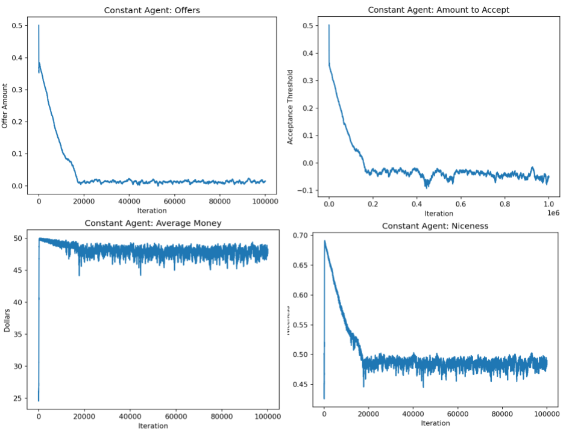

# Evolution of Iterative Ultimatum Game

### Neel Dhulipala, Ben Morris

## Abstract

We explore an iterative version of the Ultimatum Game. The Ultimatum Game is a game between two players where there is a certain amount of money that needs to be split between two players. The first proposes a way to split the money. If the second accepts, the players split the money according to the offer. Otherwise, neither player gets any money. Here, we explore an iterative version of this game, where players have some rudimentary memory and can change how they play based on previous interactions with players. We model the evolution of this model and see how fitness changes over time.

## Annotated Bibliography

Added By Hazel Smith

Sánchez, A., & Cuesta, J. A. (2005). Altruism may arise from individual selection. Journal of theoretical biology, 235(2), 233-240.

The authors of this paper suggest a model to explain altruism using the ultimatum game. The Ultimatum Game goes as follows: two players need to decide how to split M dollars. One of them is assigned to make an offer of how to split the money and the other chooses whether to accept that offer. If they refuse the offer, then neither player receives anything. In this paper the authors suggest a selection model with N players. Each player will have a threshold value of how much money they need to be offered to accept the offer / how much money they will offer. In each time step players are randomly partnered off and play the ultimatum game. In some of the timesteps players with the least amount of money die and those with the most duplicate themselves. Mutation can also occur. The authors found that players tended to evolve towards being more cooperative.
## Experiment
We create an agent-based model where each agent has two values: an acceptance threshold and an offer value. In a game between two agents, the first agent will offer an amount of money that corresponds with their offer value. If it is higher than the receiver’s acceptance threshold, the receiver accepts, and the offerer gets whatever is remaining; otherwise it rejects, and neither gets any money. The fitness of each agent is represented by the amount of money each player has after a certain number of games. During each round, two players play the ultimatum game for a total of s iterations before changing partners. This counts as one game, and there are g games per round. Each loop, after a certain number of games are played, the agents with the lowest fitnesses are discarded, and replaced by clones of the agent of highest fitness with some variability in their two parameters. The agents have no memory of previous games or information about the players they are playing against.
## Extension
For our extension, we modified the genotypes of players based on memory. The genotypes of players include their offer thresholds, acceptance thresholds, and modifiers to these thresholds that change the players’ behaviors in between games. For example, we hypothesized that an offeror whose offer was accepted might be inclined to decrease their offer during the next game to maximize their monetary gains. If an offer is rejected, the offeror may increase their next offer. With this extension, we aim to see how players evolve over time and what their genotypes look like.
Specifically, we are interested in the relationship between niceness and fitness. In our program, niceness is a metric that measures how nice offerors and acceptors are. Offerors’ niceness metrics are equal to their offer (someone who offers all the money on the table is considered to be super nice while someone who offers no money is considered not nice). This metric is averaged with the total number of acceptances divided by the number of games (accepting is considered nice). Meanwhile, fitness is a metric that measures how much money a player has.
## Results
### Results of Replication
We ran the initial experiment for 1 million iterations, measuring a few different metrics across time. In Figure 1, the first plot shows the average offer amount. As time goes on, this tends to decrease, eventually hovering just above 0; this shows that the population of agents have learned that they can offer the minimum amount of money, thereby maximizing their own amount. Similarly, the acceptance threshold tends to go down, even becoming negative towards the end. With this, agents will accept any amount offered to them, which, without memory, is the best they can do.

*Figure 1: How various metrics change over evolution time.*

The bottom row shows the amount of money earned and the average “niceness” over time. The money is how we define fitness; agents with the least amount of money after a certain number of games gets killed off, and the agent with the most mutates. This makes for an extremely fast mutation rate, as shown in the bottom left: the fitness quickly increases to 50 before levelling off. Finally, we measured niceness. The niceness metric is the average niceness between the recipients and the offerors. For recipients, niceness is the percent of time they accept an offer. For offerors, the niceness is the average amount offered (an agent is nicer if they tend to offer more money). Despite an initial spike in niceness, it eventually levels out at around 0.5. Based on the other metrics, this likely corresponds to offerors having a niceness close to 0 (offering nothing) and recipients having a niceness close to 1 (accepting everything). Unfortunately, this is not the altruism we hoped to see.
### Results of Extension
After modifying agents so that now they adapt, as highlighted in the ‘Extensions’ section, we ran a similar experiment as above. We ran the experiment for `N = 1000` of those agents for one hundred-thousand rounds, with `g = 10` games per round and `s = 10` iterations per game. (In total, there were 10 million games played.) Part of the player’s genotypes are traits that represent their responses to certain plays. If an offer is accepted or rejected, both players’ offer and acceptance thresholds change. Figure 2 shows these various traits in the players’ genotypes overtime. One aspect that is important to reserve is that players typically do not respond well to rejection. After a rejection, offer amounts tend to decrease and acceptance thresholds seem to increase, which can be seen as a disadvantage since it may be less likely that an offer will be accepted next time.
| | |
|:-------------------------:|:-------------------------:|
 |  |
 |  |

*Figure 2: How various traits in player genotype change over time. Simulation has 1000 players playing 100,000 rounds, each round with 10 games per round and 10 iterations (number of times a pair of players plays together) per game.*

Figure 3 shows the various metrics of the group, including their niceness, average offer, average acceptance, and overall fitness of the players over time. Despite the responses to rejection that are seen in Figure 2, the players seem to be cooperating for most of the game. Offerors tend to offer on average about 0.33, and acceptors tend to always accept (we can note this since the acceptance threshold for a majority of the time is below 0.25), which results in the high niceness metric.
| | |
|:-------------------------:|:-------------------------:|
 |  |
 |  |

*Figure 3: How various metrics evolve over time with adapting agents.*

It should be noted that the fitness does decrease by a large margin at the end. This is very likely due to how the agents do not handle rejection very well from both the offeror and acceptor side. Since the majority of the 10 million games played were games that resulted in offers being accepted, there was not enough time for the rejection genotypes to evolve, and when offers started getting rejected, overall fitness decreased. This becomes more evident in the acceptance plot; despite the sudden decrease in overall fitness for players, acceptance thresholds continue to rise, resulting in more rejections.

### Concerns
One concern with this project is that the program is very intensive, which means that very large simulations are not possible. In other words, we cannot run as many games as the original paper did due to our lack of memory and time. Therefore, it is possible we miss out on large trends in the data that can only be seen over millions, not thousands, of games.
### Next Steps
One potential extension to this model is to have the players alternate roles. In our model, one player is always the offeror and one is always the recipient for each game. Therefore, there is no retaliation without detriment to yourself. If instead the players switched roles each round, the initial recipient would have a chance to more effectively punish their offeror for a mean play without incurring significant loss themselves.
