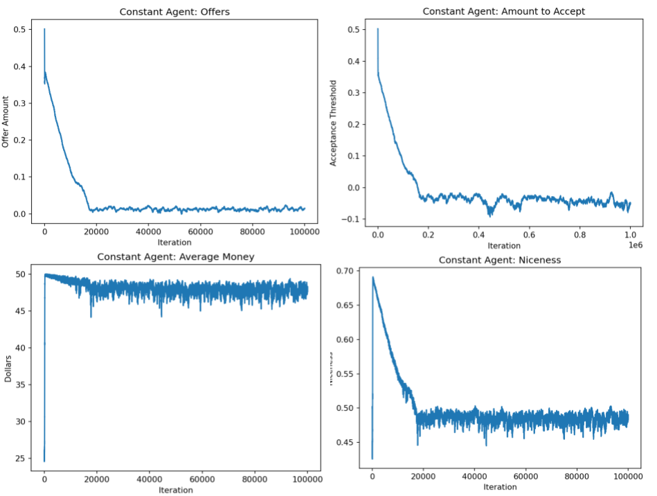

# Evolution of Iterative Ultimatum Game

### Neel Dhulipala, Ben Morris

## Abstract

We explore an iterative version of the Ultimatum Game. The Ultimatum Game is a game between two players where there is a certain amount of money that needs to be split between two players. The first proposes a way to split the money. If the second accepts, the players split the money according to the offer. Otherwise, neither player gets any money. Here, we explore an iterative version of this game, where players have some rudimentary memory and can change how they play based on previous interactions with players. Our goal in modeling player behavior is to observe if players become more altruistic over time; i.e. offers and acceptance thresholds of various players are fair. We model the evolution of this model and see how fitness changes over time.

## Experiment

We create an agent-based model where each agent has two values: an acceptance threshold and an offer value. In a game between two agents, the first agent will offer an amount of money that corresponds with their offer value. If it is higher than the receiver’s acceptance threshold, the receiver accepts, and the offerer gets whatever is remaining; otherwise, it rejects, and neither gets any money. The fitness of each agent is represented by the amount of money each player has after a certain number of games. During each round, two players play the ultimatum game for a total of *s* iterations before changing partners. This counts as one game, and there are *g* games per round. At the end of each round, the agents with the lowest fitnesses are discarded and replaced by clones of the agent of highest fitness with some variability in their two parameters. The agents have no memory of previous games or information about the players they are playing against.

## Extension

For our extension, we gave the agents the ability to react to their opponent’s plays. The genotypes of players include their offer thresholds, acceptance thresholds, and modifiers to these thresholds that change the players’ behaviors in between games based on whether the previous offer was accepted or rejected. For example, we hypothesize that an offeror whose offer was accepted might be inclined to decrease their offer during the next game to maximize their monetary gains. If an offer is rejected, the offeror may increase their next offer. With this extension, we aim to see how players evolve and what their genotypes look like.

Specifically, the relationship between niceness and fitness can give us more evidence about whether or not players can become altruistic. In our program, niceness is a metric that measures how nice offerors and acceptors are. An offeror’s niceness is equal to their offer (someone who offers all the money on the table is considered to be super nice while someone who offers no money is considered not nice). This metric is averaged with the total number of acceptances divided by the number of games (accepting is considered nice). Meanwhile, fitness is a metric that measures how much money a player has. If niceness is adaptive, niceness should increase as fitness does.

## Results

### Results of Replication

We ran the initial experiment for one million iterations, measuring a few different metrics across time. In Figure 1, the first plot shows the average offer amount. As time goes on, this tends to decrease, eventually hovering just above 0; this shows that the population of agents has learned that they can offer the minimum amount of money, thereby maximizing their amount. Similarly, the acceptance threshold tends to go down, even becoming negative towards the end. With this, agents will accept any amount offered to them, which, without memory, is the best they can do.

Figure 1: How various metrics change over evolutionary time. There are *N* = 1000 agents in this simulation, all of which have no memory or reactions to previous play.

The bottom row shows the amount of money earned and the average “niceness” over time. The money is how we define fitness; agents with the least amount of money will get killed off, and the agent with the most mutates. This makes for an extremely fast mutation rate, as shown in the bottom left: the fitness quickly increases to 50 before leveling off. Finally, we measured niceness. The niceness metric is the average niceness between the recipients and the offerors. For recipients, niceness is the percentage of time they accept an offer. For offerors, the niceness is the average amount offered (an agent is nicer if they tend to offer more money).

Despite an initial spike in niceness, it eventually levels out at around 0.5. Based on the other metrics, this likely corresponds to offerors having a niceness close to 0 (offering nothing) and recipients having a niceness close to 1 (accepting everything). Unfortunately, this is not the altruism we hoped to see. However, these results do make sense; without any memory (and therefore no retaliation), an agent can maximize their fitness by offering their opponent as little as possible, while any receptor has to accept anything given to them or else lose money themselves.

### Results of Extension

After modifying agents so that now they can remember, as highlighted in the ‘Extensions’ section, we ran a similar experiment as above. We ran the experiment for `N = 1000` of those agents for one-hundred-thousand rounds, with `g = 10` games per round and `s = 10` iterations per game. In total, there were 10 million games played. Figure 2 shows the various metrics of the group, including their niceness, average offer, average acceptance, and overall fitness of the players over time.

| | |
|:-------------------------:|:-------------------------:|
 |  |
 |  |

Figure 2: How various metrics evolve over time with adapting agents.

Part of the player’s genotypes are traits that represent their responses to certain plays. If an offer is accepted or rejected, both players’ offer and acceptance thresholds change. Figure 3 shows these various traits in the players’ genotypes over time. One aspect that is important to reserve is that players typically do not respond well to rejection. After a rejection, offer amounts tend to decrease and acceptance thresholds seem to increase, which can be seen as a disadvantage since it may be less likely that an offer will be accepted next time.

| | |
|:-------------------------:|:-------------------------:|
 |  |
 |  |

Figure 3: How various traits in player genotype change over time. Simulation has 1000 players playing 100,000 rounds, each round with 10 games per round and 10 iterations (number of times a pair of players plays together) per game. From upper left going clockwise: the average change among agents in their acceptance threshold overtime after acceptances, the average change among agents in their acceptance thresholds overtime after rejections, the average change among agents in their offer thresholds overtime after rejections, and the average change among agents in their offer thresholds overtime after acceptances. Note that these are derived from the agents’ genotypes, and they change over time as a result of mutation and the worst players being removed from the player pool.

### Interpretation

Despite the responses to rejection that are seen in Figure 3, the players seem to be cooperating for most of the game.

In the replication of the initial experiment, the offeror seems to always take advantage of their situation. Within the first 20,000 runs, offer amounts tend to hover around 0, along with acceptance thresholds. This is a give-nothing, accept-everything approach that is more reminiscent of exploitation than altruism. With no ability for retaliation, a non-altruistic approach is the best that agents can do.

The behaviors of players over time never seem to stabilize in the experiment extension. This becomes more evident closer to the last few timesteps as the fitness and niceness levels decrease rapidly. That being said, for the majority of the games, the players seem to cooperate. Offerors tend to offer on average about 0.33, and acceptors tend to always accept (we can note this since the acceptance threshold for a majority of the time is below 0.25), which results in the high niceness metric. This hints at the potential for agents to be altruistic, but they are not quite there.

It should be noted that the fitness does decrease by a large margin at the end. This is likely due to how the agents do not handle rejection well from both the offeror and acceptor sides. Since the majority of the 10 million games played were games that resulted in offers being accepted, there was not enough time for the rejection genotypes to evolve, and when offers started getting rejected, overall fitness decreased. This becomes more evident in the acceptance plot; despite the sudden decrease in overall fitness for players, acceptance thresholds continue to rise, resulting in more rejections.

## Conclusion

Under circumstances where the agents have a conscience and can adapt based on the results of games, there are signs that these agents *can* be altruistic. Our model shows this through the contrast between the average niceness of the agents in our replication, where agents have no memory and play for the best outcome, and our extension, where players make decisions based on the previous play. However, even in the extension, agents are still not very altruistic - they still tend to offer much less than half the money. This likely stems from the power differential inherent in this version of the Ultimatum Game, where the offeror can low ball as much as possible with almost no backlash. This may imply that altruism can only arise in situations where players can retaliate.

### Next Steps

Another extension of the Ultimatum game could be one where the players switch roles each game; the offeror becomes the recipient and the recipient the offeror. This might have the effect of “evening the playing field” - removing any power dynamic inherent in the game. In this version, one might see a higher level of altruism than that observed here.

## Annotated Bibliography

Altruism may arise from individual selection
Added By Hazel Smith
Sánchez, A., & Cuesta, J. A. (2005). Altruism may arise from individual selection. Journal of theoretical biology, 235(2), 233-240.
The authors of this paper suggest a model explaining altruism using the ultimatum game. The Ultimatum Game goes as follows: two players need to decide how to split *M* dollars. One of them is assigned to make an offer of how to split the money and the other chooses whether to accept that offer. If they refuse the offer, then neither player receives anything. In this paper, the authors suggest a selection model with *N* players. Each player will have a threshold value of how much money they need to be offered to accept the offer / how much money they will offer. In each time step players are randomly partnered off and play the ultimatum game. In some of the timesteps players with the least amount of money die and those with the most duplicate themselves. Mutation can also occur. The authors found that players tended to evolve towards being more cooperative.
